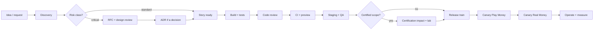

# 1. The Flow

# 2. Risk Classes

Every piece of work is classified at refinement. The class decides how much process it needs.

@widths 1,2.6,1.4
| Class | Examples | Extra requirements |
|---|---|---|
| Standard | UI change, new lobby filter, new report | Story + DoD |
| Sensitive | New endpoint with personal data, new provider adapter, integrity detector, promotion type | Short design note in the ticket; security review checklist |
| Critical | Engine rules, RNG, ledger postings, payouts, auth/tokens, jurisdiction logic, infrastructure permissions | RFC with design review; two approvals; finance/compliance reviewer; feature flag; staged rollout; for certified scope: certification impact assessment |

# 3. Stages

@widths 1.1,2.4,1.5
| Stage | Activities | Exit artefact |
|---|---|---|
| Discovery | Problem statement, users, data, regulatory impact, rough size | Epic with one-page brief |
| Design | UX, API/socket contract draft, data model, RFC for critical work | Figma link, spec PR, RFC/ADR |
| Ready | Acceptance criteria as examples, dependencies, risk class, estimates | Story meets Definition of Ready (KP-QA-02 §1) |
| Build | Code, tests, telemetry, docs, flags | PR meets checklist |
| Verify | CI, preview, staging E2E, exploratory testing, performance smoke | Green pipeline, QA sign-off for the release |
| Release | Release train, canaries, approvals (KP-QA-03) | Release notes |
| Operate | Dashboards, alerts, SLOs, support briefing, learning | Metrics reviewed after 2 weeks |

# 4. Who Approves What

@widths 2.4,2.6
| Change | Approvers |
|---|---|
| Standard code | 1 code owner |
| Critical code | 2 approvers incl. component tech lead (KP-ENG-11 §5) |
| API breaking change | Tech Lead Platform + consumers' owners; new version or ADR |
| Game rule change (engine, House Rules) | Tech Lead Game + Head of Poker + Compliance Officer |
| Rake, fees, paytables | CFO (four-eyes in back-office) |
| Jurisdiction policy | Compliance Officer + second approver |
| Real Money release | Release manager; compliance for rule/policy changes |

# 5. Service Levels for the Process Itself

- Code review: first response the same working day.
- RFC review: decision within 5 working days of the review meeting.
- Release train: weekly (Tuesday); clients every 2 weeks.
- Hotfix: S1 within hours, S2 within 24 h (KP-QA-01 §7).

# 6. Delivery Metrics (DORA)

@widths 2,1.5,1.5
| Metric | Target at Beta | Target at GA |
|---|---|---|
| Deployment frequency (services) | Weekly | Several per week |
| Lead time for changes (merge → production) | < 7 days | < 2 days |
| Change failure rate | < 15 % | < 10 % |
| Time to restore (P1/P2) | < 4 h | < 1 h |

Metrics are reviewed monthly in the engineering review; they measure the system, not individuals.
