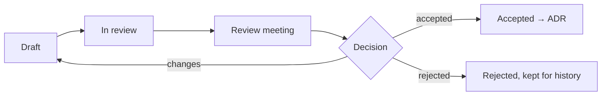

# 1. When an RFC Is Required

Write an RFC (Request for Comments) when a change is **critical** (KP-HBK-03 §2), crosses team boundaries, adds a new service, data store or vendor, changes a public contract in a breaking way, or will take more than 3 engineer-weeks. When in doubt, write a short one: a two-page RFC is cheaper than a wrong month.

# 2. Lifecycle



1. **Draft** in `docs/rfcs/NNNN-short-title.md` from the template below; open a PR labelled `rfc`; post it in `#rfc`.
2. **Async review** for at least 3 working days. Required reviewers: owners of affected components, security for anything with data or money, finance for ledger/payments, compliance for rules/jurisdictions/responsible gaming.
3. **Review meeting** (bi-weekly architecture review, 45 minutes): only open questions are discussed.
4. **Decision** by the CTO (or delegated tech lead) recorded in the RFC; if it decides an architectural question, an ADR is written and linked.
5. Merge the RFC with its final status. Implementation tickets link to it.

# 3. Template

```
# RFC-NNNN: <title>
Status: Draft | In review | Accepted | Rejected | Superseded   Author(s):   Reviewers:   Date:
Risk class: standard | sensitive | critical      Affected docs: KP-ENG-xx §y …

## Summary            (5 lines: what and why)
## Context            (current state, problem, constraints: money, fairness, compliance, latency, team)
## Goals / Non-goals
## Proposal           (design, diagrams, contracts, data model, sequence of events)
## Money and fairness impact   (ledger postings, invariants, engine rules, RNG, certification impact)
## Security and privacy        (threats, data classes, access)
## Compliance                  (jurisdictions, responsible gaming, reporting)
## Operations                  (SLOs, alerts, runbooks, migration and rollback)
## Alternatives considered
## Rollout plan                (flags, jurisdictions, canary, success metrics)
## Open questions
```

# 4. Review Checklist for Reviewers

- [ ] Does the proposal keep every invariant in KP-ENG-01 §11?
- [ ] Is every money movement a balanced posting with a deterministic idempotency key?
- [ ] Could a client, operator or staff member gain information or money they should not have?
- [ ] What happens when each dependency is slow or down?
- [ ] Is the rollout reversible? What does rollback do to data already written?
- [ ] Which documents change, and are they updated in the same PR?

# 5. Lightweight Design Notes

Sensitive (not critical) changes use a design note in the ticket instead of an RFC: problem, approach, contract changes, data changes, risks, test plan. Reviewed by the tech lead during refinement.
