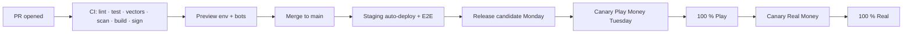

# 1. The Path of a Change

# 2. Weekly Train (services and web)

@widths 1.1,3.9
| When | Step |
|---|---|
| Monday 10:00 | Release sync; the release manager tags `rc` from `main`; QA regression starts in staging |
| Monday 17:00 | QA sign-off or blockers listed |
| Tuesday 09:00 | Promotion PR for `play`; Argo Rollouts canary 5 % for 30–60 min with automatic analysis |
| Tuesday 11:00 | 100 % Play Money |
| Tuesday 14:00 | Promotion PR for `real` (approval by release manager; compliance for rule/policy changes); canary; 100 % |
| Tuesday 16:00 | Release notes published; support briefed |

No Real Money promotions on Friday, before public holidays in launch markets, or during major tournament series peaks.

# 3. Canary Analysis

Automatic rollback if, compared with the stable version over the same period: error rate +50 %, action p99 > 30 ms, voided hands > 0.05 %, deposit success −10 points, or any P1 alert fires.

# 4. Rollback

`argocd app rollback <app> <revision>` or revert the promotion PR. Table-servers drain between hands, so rollback does not void hands. Database migrations are backward compatible (KP-HBK-13), so code rollback is safe.

# 5. Hotfix

Branch from the release tag, fix with a test, PR with `hotfix` label, expedited review (one approver + tech lead for critical code), deploy through the same pipeline with shortened canary (10 min). Cherry-pick to `main` in the same day.

# 6. Mobile Releases

Every two weeks: internal track → closed testers (staff + Beta community) → staged rollout 1 % → 10 % → 50 % → 100 % with crash-free ≥ 99.5 % gates. Forced minimum version only for security or certified-component changes.

# 7. Certified Components

If a release contains a certified component digest not in the certification register, the `real` promotion job fails. Follow KP-QA-05 §5 (notify or re-test) and update the register after lab approval.
